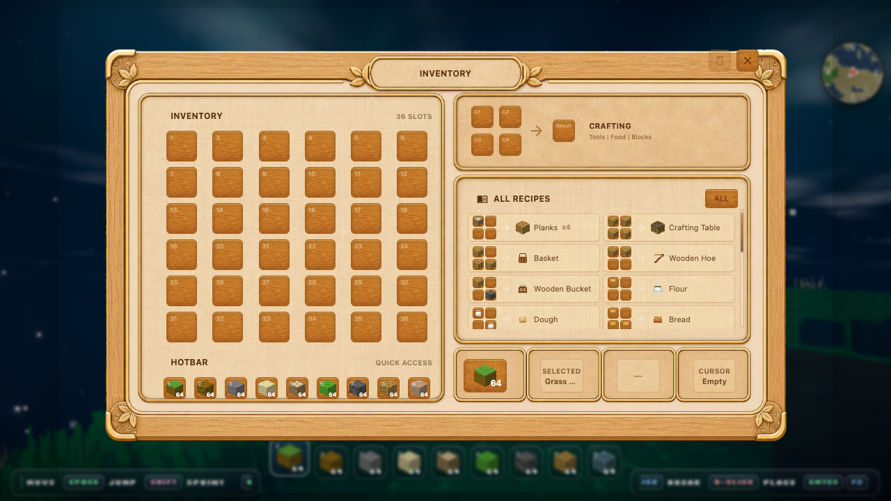

<p align="center">
  
</p>

<h1 align="center">Dawnlight</h1>

<p align="center">
  A browser-based voxel world game built with React, Three.js, and TypeScript.
</p>

<p align="center">
  <a href="https://dawn.lt"><strong>Play Dawnlight</strong></a>
  ·
  <a href="https://github.com/hmmhmmhm/dawnlt">Source</a>
</p>

<p align="center">
  
  
  
  
</p>

## What Is Dawnlight?

Dawnlight is a lightweight 3D sandbox for the browser. It combines procedural terrain, dynamic lighting, weather, seasons, farming, crafting, inventory interactions, and responsive controls across desktop and mobile.

## Features

- Procedural terrain with mountains, beaches, lakes, caves, and biomes
- Dynamic day, evening, and night lighting
- Weather and seasonal texture changes
- Farming, gathering, crafting, and inventory systems
- Keyboard, mouse, gamepad, and mobile touch controls
- Web Worker based chunk and mesh generation
- Optional far LOD rendering path for larger views

## Run Locally

```bash
pnpm install
pnpm dev
```

The app is served by Vite from `apps/dawnlight`.

## Quality Checks

```bash
pnpm lint
pnpm --dir apps/dawnlight exec tsc --noEmit
pnpm --dir apps/dawnlight test --runInBand
pnpm build
```

## Requirements

- Node.js 22 or newer
- pnpm 10.33.4

## Project Structure

```text
apps/dawnlight/
  src/
    components/  React UI and HUD components
    engine/      Rendering, physics, world systems
    game/        Game loop, input, interaction logic
    hooks/       React integration hooks
    shared/      Worker-safe shared logic
    workers/     Mesh and LOD workers
docs/
  assets/        README and social preview images
  design/        Design notes
  lod/           LOD notes and samples
```

## Public Repository Notes

This repository is a public source snapshot for Dawnlight. It does not include deployment credentials or deployment automation. Local environment files such as `.env.local` are intentionally ignored.
